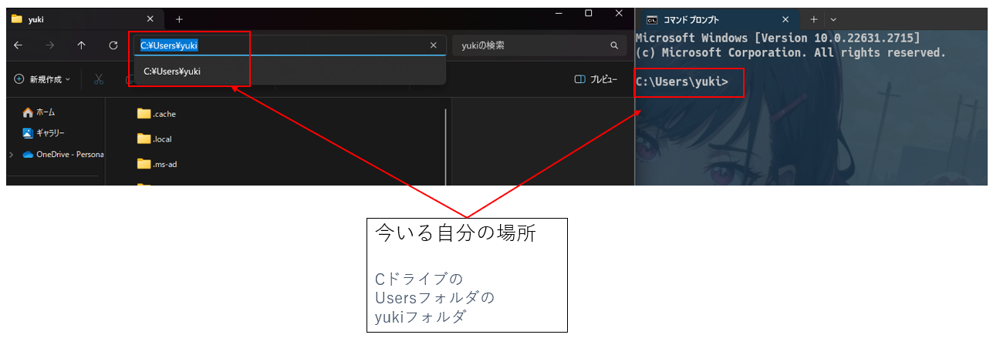

# CUIの初歩
## 対象者
→日常用途以外の難しい操作をした事のない、Windowsユーザー

## GUIとCUI
- GUI(Graphical User Interface)
  - 絵付きの画面
  - マウスでカチカチして操作
  - 直感的
- CUI(Character User Interface)
  - 文字のみの画面
  - 所謂黒い画面
  - コマンドで操作
  - 出力結果も全部文字のみ

## cmd
- 起動方法  
`Win+R→cmd→Enter`が一番モテるやり方
- (ちょっと違うけど、)cmdはExplorerの、CUI版のようなもの  
厳密にいうと、  
```
cmdはCUIツールであり、ExplorerのCUI版としての機能も兼ねてる
```
という感じ



- 超初歩的なコマンド
  - `echo`  
  →何をやるにもまずは"Hello, World!!"でしょ
  ```bat
  echo "Hello, World!!"
  ```
  - ファイル操作系
    - `dir`
    - `tree`
    - `cd`
    - `mkdir`
    - `copy`
    - `del`
    - `move`
  - ネットワーク系
  - `ping`
  - `ipconfig`
  - その他
    - `explorer`  
    →今いるフォルダをexplorerで開くコマンド
- リダイレクト  
→コマンドの出力結果をテキストファイルに焼くこと  
　結構よく使う
  - 簡単な例
  ```bat
  @rem ">"で新規作成
  echo "Hello, World!!" > hello.txt
  @rem ">>"で上書き
  echo "上書きだよー" >> hello.txt
  ```
  - treeコマンドの出力結果をテキストに焼いてみる
  ```bat
  tree > tree.txt
  ```
- 環境変数と`%PATH%`  
→これは多分まだ難しいとは思うけど、大事だから頑張ってみる
  - 環境変数  
  プログラミングでいうところの変数と同じ。  
  システムを動かすのに必要な情報が変数として保持されている。  
  cmdでは変数は`%変数名%`で呼びだせる。  
  例えば、`%username%`という環境変数の中身を見るには、
  ```bat
  echo %username%
  ```
  とすれば良い。
  - `%PATH%`
  `%PATh%`というのは、環境変数の中でも、特に重要なやつ。

- バッチファイルについて  

## LinuxのCUI(bash)
cmdはWindows用。  
bashというのは、cmdのLinux版だと思ってくれれば。  
この前おとかさんが教えてくれたのは、この話のはず。  
